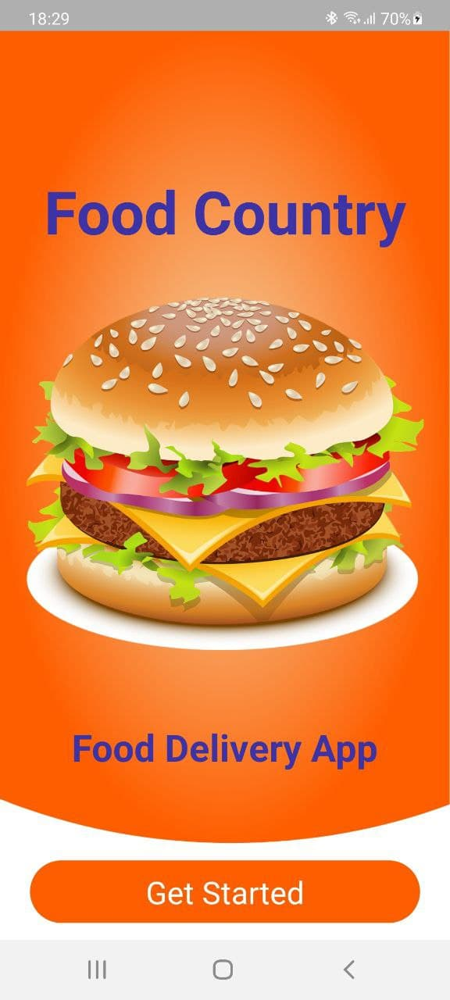
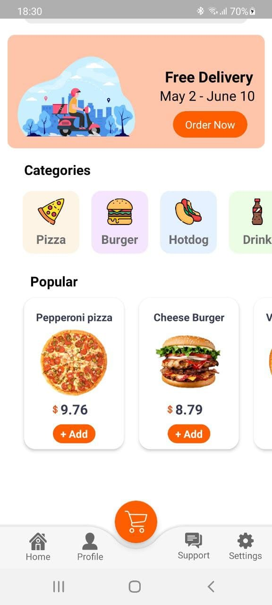
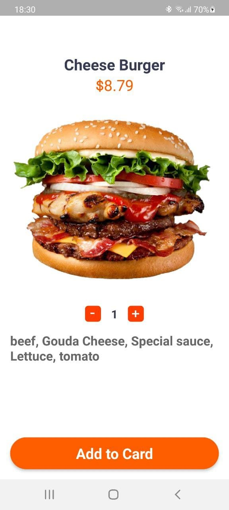
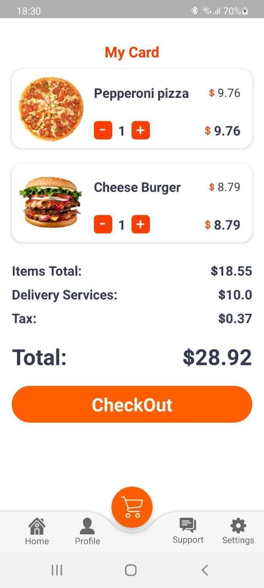

# Food Country

## Description 
Food Country это приложение для заказов еды онлайн.\
На данный момент приложение является всего лишь прототипом для демонстрации и не обладает полным функционалом.\
Сейчас в нем реализована основная визуальная состовляющая, а также функция составления заказа, \
который сохраняется при вашем выходе из приложения.

## Установка
Так как проект является демонстарционным то он отсутствует в Play Market.\
Для его установки вам необхадимо будет локально скоприровать репозиторий проекта.\
После надо будет открыть проект при помощи вашего IDE.\
Если вы хотите устанвоить  его себе на девайс, то необхадимо будет для отладки подключить и настроить ваше персональное устройство.\
Для запуска в эмуляторе дополнительных действий не требуется.

## Usage
Приложения визульно просто в использовании. Ниже будет приведен ряд скриншотов приложения с описанием.\

`Стартовая страница приложения`
Для начала нажмите `Get started`

`Основное меню приложения с выбором товаров`
Для добавления товара нажмите на `+add` 

`Добавление товара в корзину`
Выберите количество товаров и нажмите `Add to card`

`Меню коризины`
Для оформления заказа нажмите `CheckOut`

## Contribution

Данный проект был разработан студентами 12 группы 3 курса.\
Гиро Елизавета - разработка и документация\
Горшков Даниил - разработка и документация, настройка тестирования

